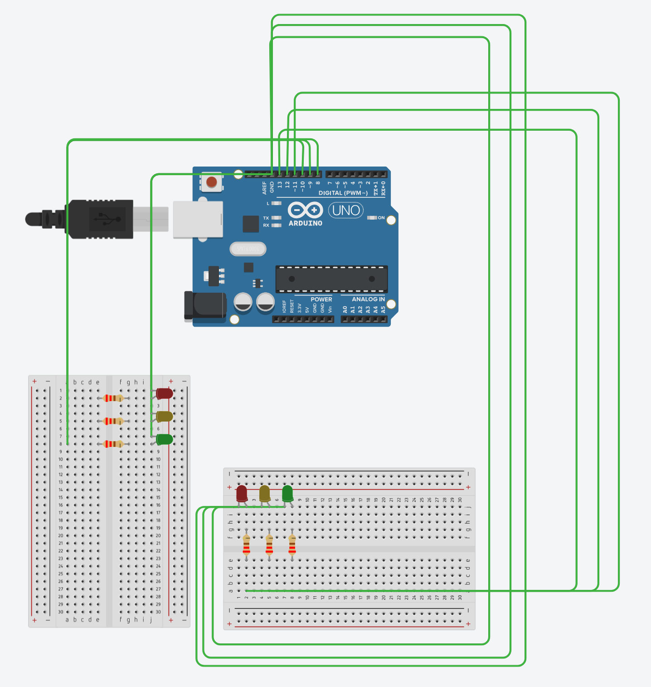

# Traffic Light in C

This project is a simple implementation of a traffic light controller using the C programming language. The program simulates the behavior of a traffic light system, managing the states of traffic lights for both north-south and east-west directions.

More of my personal Notes (coming soon)

## Picture of my Arduino

| Light Behavior                     | Binary Value (PORTB) | Decimal Value (PORTB) | Pin States (D13-D8)      | Description of Lights                          |
|------------------------------------|-----------------------|------------------------|--------------------------|------------------------------------------------|
| **NS: RED, EW: RED**               | `0b00100100`          | 36                     | D13: HIGH, D10: HIGH     | North-South RED, East-West RED                |
| **NS: RED & YELLOW, EW: RED**      | `0b00110100`          | 52                     | D13: HIGH, D12: HIGH, D10: HIGH | North-South RED & YELLOW, East-West RED       |
| **NS: GREEN, EW: RED**             | `0b00101000`          | 40                     | D13: HIGH, D11: HIGH     | North-South GREEN, East-West RED              |
| **NS: GREEN & YELLOW, EW: RED**    | `0b00111000`          | 56                     | D13: HIGH, D12: HIGH, D11: HIGH | North-South GREEN & YELLOW, East-West RED    |
| **NS: RED, EW: RED (Overlap)**     | `0b00100100`          | 36                     | D13: HIGH, D10: HIGH     | North-South RED, East-West RED                |
| **NS: RED, EW: RED & YELLOW**      | `0b00100110`          | 38                     | D13: HIGH, D10: HIGH, D9: HIGH | North-South RED, East-West RED & YELLOW       |
| **NS: RED, EW: GREEN**             | `0b00100001`          | 33                     | D13: HIGH, D8: HIGH      | North-South RED, East-West GREEN              |
| **NS: RED, EW: GREEN & YELLOW**    | `0b00100011`          | 35                     | D13: HIGH, D9: HIGH, D8: HIGH | North-South RED, East-West GREEN & YELLOW    |
