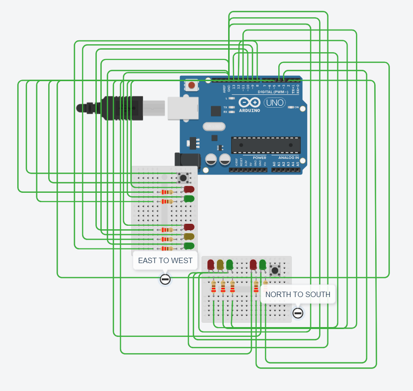

# Traffic Light in C
This is a continuation of my main branch. Here I have added pedestrian lights.
for now they will both lights will only turn on or off. The logic and timing will be added later on.

More of my personal Notes (coming soon)

## Picture of my Arduino

| Light Behavior                     | Binary Value (PORTB) | Decimal Value (PORTB) | Pin States (D13-D8)      | Binary Value (PORTD) | Decimal Value (PORTD) | NS Pedestrian (D3-D2) | EW Pedestrian (D6-D5) | Description of Lights                          |
|------------------------------------|-----------------------|------------------------|--------------------------|-----------------------|------------------------|------------------------|------------------------|------------------------------------------------|
| **NS: RED, EW: RED**               | `0b00100100`          | 36                     | D13: HIGH, D10: HIGH     | `0b00100100`          | 36                     | D3: LOW, D2: HIGH      | D6: LOW, D5: HIGH      | North-South RED, East-West RED, Pedestrian RED |
| **NS: RED & YELLOW, EW: RED**      | `0b00110100`          | 52                     | D13: HIGH, D12: HIGH, D10: HIGH | `0b00100100`          | 36                     | D3: LOW, D2: HIGH      | D6: LOW, D5: HIGH      | North-South RED & YELLOW, East-West RED, Pedestrian RED |
| **NS: GREEN, EW: RED**             | `0b00101000`          | 40                     | D13: HIGH, D11: HIGH     | `0b00001000`          | 8                      | D3: HIGH, D2: LOW      | D6: LOW, D5: HIGH      | North-South GREEN, East-West RED, NS Pedestrian GREEN |
| **NS: GREEN & YELLOW, EW: RED**    | `0b00111000`          | 56                     | D13: HIGH, D12: HIGH, D11: HIGH | `0b00001000`          | 8                      | D3: HIGH, D2: LOW      | D6: LOW, D5: HIGH      | North-South GREEN & YELLOW, East-West RED, NS Pedestrian GREEN |
| **NS: RED, EW: RED (Overlap)**     | `0b00100100`          | 36                     | D13: HIGH, D10: HIGH     | `0b00100100`          | 36                     | D3: LOW, D2: HIGH      | D6: LOW, D5: HIGH      | North-South RED, East-West RED, Pedestrian RED |
| **NS: RED, EW: RED & YELLOW**      | `0b00100110`          | 38                     | D13: HIGH, D10: HIGH, D9: HIGH | `0b00100100`          | 36                     | D3: LOW, D2: HIGH      | D6: LOW, D5: HIGH      | North-South RED, East-West RED & YELLOW, Pedestrian RED |
| **NS: RED, EW: GREEN**             | `0b00100001`          | 33                     | D13: HIGH, D8: HIGH      | `0b01000000`          | 64                     | D3: LOW, D2: HIGH      | D6: HIGH, D5: LOW      | North-South RED, East-West GREEN, EW Pedestrian GREEN |
| **NS: RED, EW: GREEN & YELLOW**    | `0b00100011`          | 35                     | D13: HIGH, D9: HIGH, D8: HIGH | `0b01000000`          | 64                     | D3: LOW, D2: HIGH      | D6: HIGH, D5: LOW      | North-South RED, East-West GREEN & YELLOW, EW Pedestrian GREEN |
